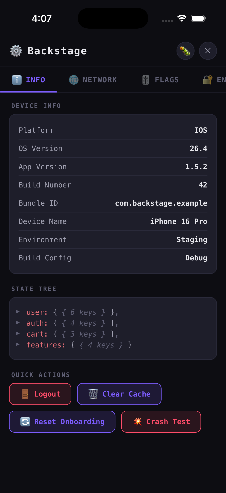
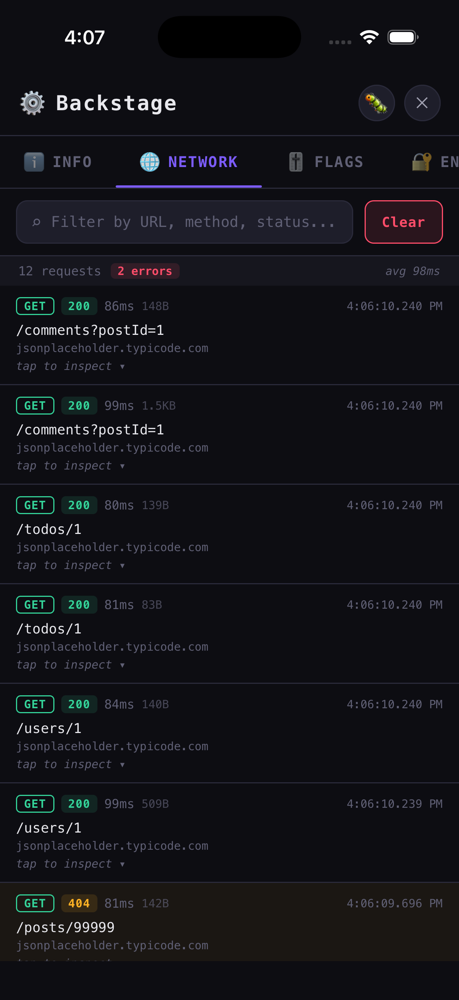
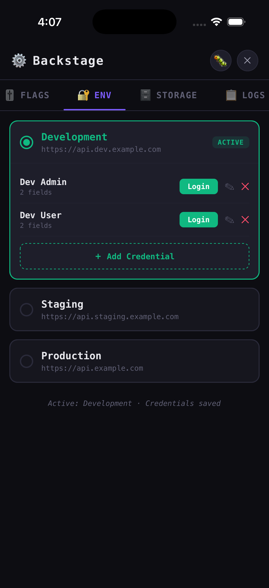
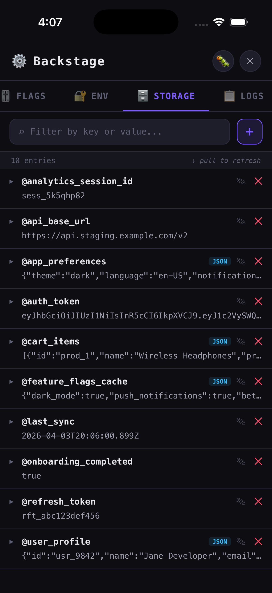
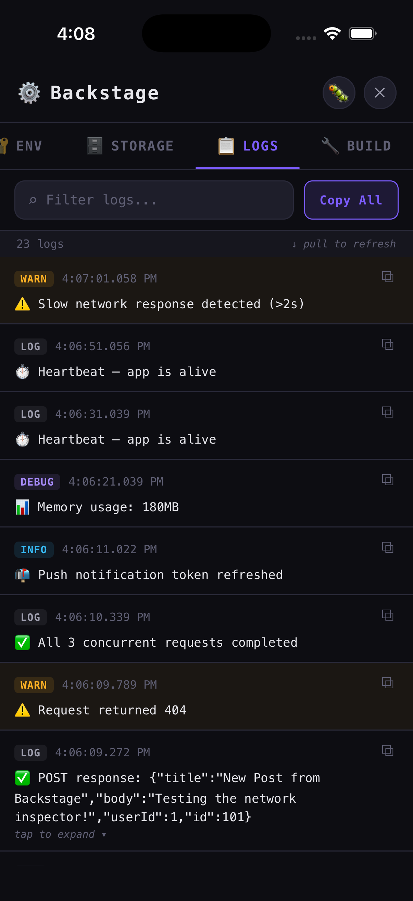
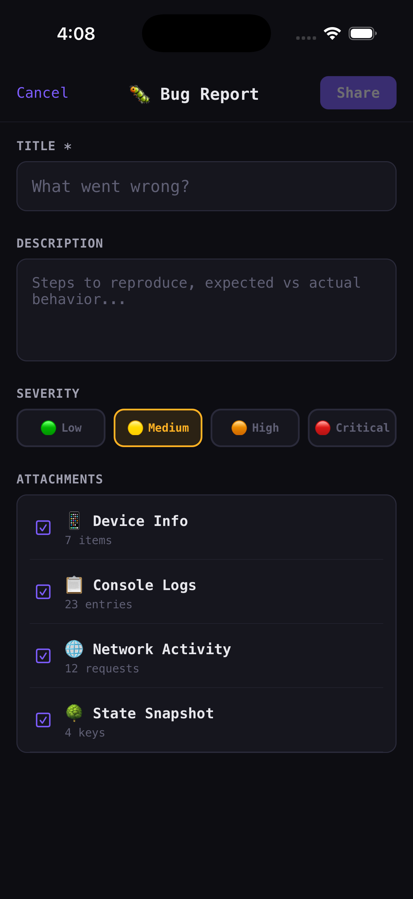

# rn-backstage

[](https://www.npmjs.com/package/rn-backstage)
[](https://www.npmjs.com/package/rn-backstage)

A zero-dependency developer/QA debug panel for React Native apps. Inspect device info, view state trees, monitor console logs, inspect network requests, and trigger custom actions — all from a sleek in-app panel.

<p align="center">
  
  
  
  
  
  
</p>

## Features

- 🎯 **Draggable floating pill** — always accessible, repositionable trigger with safe area bounds
- 📱 **Device & build info** — OS version, app version, build number, and custom data
- 🌳 **State tree inspector** — visualize Redux, Zustand, or any store state
- 🔍 **React Query inspector** — snapshot every cached query's raw payload, staleness, and fetch status
- 📋 **Console log viewer** — intercepts all console methods with search & filtering
- 🌐 **Network inspector** — intercepts fetch & XMLHttpRequest with request/response details, headers, body, timing, and copy-as-cURL
- 🎚 **Feature flag toggle** — render switches to toggle flags in real-time without restarting
- 🗄 **Storage viewer** — inspect, edit, and delete AsyncStorage/MMKV entries via a pluggable adapter
- ⚡ **Quick actions** — add custom buttons (logout, clear cache, etc.)
- 🔌 **Extensible tabs** — add custom tabs for app-specific debugging tools
- 🎨 **Light & dark theme** — auto-follows device setting, or override manually
- 📦 **Zero dependencies** — only peer deps are `react` and `react-native`

## Installation

```sh
npm install rn-backstage
# or
yarn add rn-backstage
```

No additional native dependencies required!

## Usage

```tsx
import { Backstage } from 'rn-backstage'

export default function App() {
  return (
    <>
      {/* Your app content */}
      <Backstage
        appVersion="1.2.3"
        buildNumber="42"
        bundleId="com.example.app"
        state={store.getState()}
        quickActions={[
          { title: 'Logout', onPress: handleLogout, destructive: true },
          { title: 'Clear Cache', onPress: clearCache },
        ]}
        onCopyLogs={logs => Clipboard.setString(logs)}
      />
    </>
  )
}
```

## Network Inspector

The Network tab automatically intercepts all `fetch()` and `XMLHttpRequest` traffic — including libraries built on top of them like **Axios**, **Apisauce**, **ky**, and **Apollo Client**.

Each request shows:

- Method, URL, status code, and duration
- Request & response headers
- Request & response body (auto-parsed JSON with tree view)
- Response size
- Copy as cURL (long-press any request)

```tsx
<Backstage
  // Network inspector is enabled by default
  enableNetworkInspector={true}
  // Exclude noisy URLs (analytics, Sentry, etc.)
  networkFilters={['sentry.io', 'analytics', 'hot-update']}
  // Limit body capture size (default: 64KB)
  maxNetworkBodySize={65536}
  // Auto-filters console.logs from Axios interceptors / fetch .then() chains
  // out of the Logs tab (they're already in the Network tab). Default: true
  autoFilterNetworkLogs={true}
/>
```

## Feature Flag Toggle

Pass feature flags to render a dedicated **Flags** tab with toggle switches. The tab only appears when at least one flag is provided. Toggling calls your callback in real-time — no app restart needed.

```tsx
const [flags, setFlags] = useState([
  { key: 'dark_mode', label: 'Dark Mode', value: true, description: 'Enable dark theme' },
  { key: 'beta', label: 'Beta Features', value: false, description: 'Experimental features' },
])

<Backstage
  featureFlags={flags}
  onToggleFeatureFlag={(key, value) => {
    setFlags(prev => prev.map(f => (f.key === key ? { ...f, value } : f)))
  }}
/>
```

## Storage Viewer

Pass a `storageAdapter` to render a **Storage** tab that lets you browse, edit, add, and delete key-value entries. The tab only appears when an adapter is provided. Works with any storage backend — zero dependencies.

```tsx
import AsyncStorage from '@react-native-async-storage/async-storage'
;<Backstage
  storageAdapter={{
    getAllKeys: () => AsyncStorage.getAllKeys(),
    getItem: key => AsyncStorage.getItem(key),
    setItem: (key, value) => AsyncStorage.setItem(key, value),
    removeItem: key => AsyncStorage.removeItem(key),
  }}
/>
```

MMKV example:

```tsx
import { storage } from './mmkv'
;<Backstage
  storageAdapter={{
    getAllKeys: () => Promise.resolve(storage.getAllKeys()),
    getItem: key => Promise.resolve(storage.getString(key) ?? null),
    setItem: (key, value) => Promise.resolve(storage.set(key, value)),
    removeItem: key => Promise.resolve(storage.delete(key)),
  }}
/>
```

## React Query Inspector

Pass your `QueryClient` to add a `reactQuery` node to the State Tree holding every cached query — the **raw** payload as the cache actually stores it, plus the status you cannot see from the payload alone.

```tsx
import { queryClient } from './services/query'
;<Backstage queryClient={queryClient} />
```

The client is read through a structural type the package declares itself, so there is no dependency on `@tanstack/react-query` and the same prop accepts a v4 or a v5 client.

Each query becomes an entry keyed by its query key, holding the payload under `data` and its status under `_meta`:

```
reactQuery
  me
    _meta ▶    { status: 'success', fetchStatus: 'idle', isStale: false, updatedAt: '2:04:11.208 PM' }
    data  ▶    { id: 'usr_9842', name: 'Jane Developer', … }
  sites
    false ▶    { _meta, data }        // ['sites', false]
    true  ▶    { _meta, data }        // ['sites', true]
  siteZones
    site_1 ▶   { _meta, data }        // ['site-zones', 'site_1']
```

- A kebab-case resource is camelCased, so `['site-zones', id]` becomes a `siteZones` node.
- Every key element after the first forms the entry label, joined by ` | ` — so `['sites', false]` and `['sites', siteId]` stay distinct siblings instead of collapsing onto each other.
- A resource cached under both a bare and a keyed form puts the bare payload under `(root)`.
- Queries with nothing to show are omitted: an unresolved payload, and a key with a `null`/`undefined` part (a disabled observer mounted before its input was known). An **errored** query is kept even with no data — that is usually the thing you opened the panel to see.

The snapshot is rebuilt on a throttle only while the panel is open, so a closed panel subscribes to nothing and costs nothing:

```tsx
<Backstage
  queryClient={queryClient}
  // How often the snapshot is rebuilt while the panel is open. Default: 1000
  queryStateThrottleMs={1000}
/>
```

## Bug Report

Add a `bugReport` config to enable one-tap bug reporting. Tapping the 🐛 button in the panel header opens a composer that auto-attaches device info, logs, network activity, and state. Reports can be shared via the system share sheet or submitted to a webhook.

```tsx
<Backstage
  bugReport={{
    onSubmit: report => {
      // Full BugReport object with all context
      console.log(report.title, report.severity, report.logs.length)
    },
    // Optional: POST to a webhook
    webhookUrl: 'https://your-api.com/bugs',
    // Optional: capture screenshot (requires a library like react-native-view-shot)
    captureScreenshot: () => viewShotRef.current.capture(),
    maxLogsInReport: 50,
    maxNetworkEntriesInReport: 20,
  }}
/>
```

## Environment Switcher

Add an `environmentConfig` prop to enable per-environment credential management and login. Each environment shows a card with radio selection. The active environment expands to show saved credentials — each with **Login**, **Edit**, and **Delete** actions. Add/edit opens a fullscreen modal with `KeyboardAvoidingView`.

```tsx
const [activeEnv, setActiveEnv] = useState('dev')

<Backstage
  environmentConfig={{
    environments: [
      { key: 'dev', label: 'Development', baseUrl: 'https://api.dev.example.com', color: '#10B981' },
      { key: 'staging', label: 'Staging', baseUrl: 'https://api.staging.example.com', color: '#F59E0B' },
      { key: 'prod', label: 'Production', baseUrl: 'https://api.example.com', color: '#EF4444' },
    ],
    activeEnvironment: activeEnv,
    onEnvironmentChange: key => setActiveEnv(key),
    credentialFields: [
      { key: 'email', label: 'Email', keyboardType: 'email-address' },
      { key: 'password', label: 'Password', secureTextEntry: true },
    ],
    onLogin: (envKey, credentials) => {
      // credentials = { email: '...', password: '...' }
      authService.login(envKey, credentials)
    },
    // Pre-fill multiple credentials per environment
    initialCredentials: {
      dev: [
        { name: 'Admin', values: { email: 'admin@dev.example.com', password: 'admin123' } },
        { name: 'Test User', values: { email: 'user@dev.example.com', password: 'user123' } },
      ],
    },
    // Optional: persist credentials to storage (reuses StorageAdapter)
    storageAdapter: myStorageAdapter,
  }}
/>
```

When `storageAdapter` is provided, credentials auto-save on change and auto-load on mount. Without it, credentials are in-memory only.

## Props

| Prop                     | Type                          | Default     | Description                                     |
| ------------------------ | ----------------------------- | ----------- | ----------------------------------------------- |
| `visible`                | `boolean`                     | `true`      | Show/hide the floating pill                     |
| `theme`                  | `'light' \| 'dark' \| 'auto'` | `'auto'`    | Theme preference; auto follows device setting   |
| `appVersion`             | `string`                      | `undefined` | App version to display                          |
| `buildNumber`            | `string`                      | `undefined` | Build number                                    |
| `bundleId`               | `string`                      | `undefined` | Bundle identifier                               |
| `deviceInfo`             | `AppInfoItem[]`               | `[]`        | Additional device/app info rows                 |
| `state`                  | `object`                      | `undefined` | State tree to inspect                           |
| `quickActions`           | `QuickAction[]`               | `[]`        | Custom action buttons                           |
| `featureFlags`           | `FeatureFlag[]`               | `[]`        | Feature flags with toggle switches              |
| `onToggleFeatureFlag`    | `(key, val: boolean) => void` | `undefined` | Callback when a flag is toggled                 |
| `storageAdapter`         | `StorageAdapter`              | `undefined` | Storage adapter for the Storage Viewer tab      |
| `queryClient`            | `QueryClientLike`             | `undefined` | React Query client; adds a `reactQuery` node     |
| `queryStateThrottleMs`   | `number`                      | `1000`      | React Query snapshot rebuild interval (ms)      |
| `maxLogs`                | `number`                      | `500`       | Maximum logs to retain                          |
| `logFilters`             | `string[]`                    | `[]`        | Messages to exclude from logs                   |
| `onCopyLogs`             | `(logs: string) => void`      | `undefined` | Callback when copying logs                      |
| `enableNetworkInspector` | `boolean`                     | `true`      | Enable/disable network request interception     |
| `maxNetworkEntries`      | `number`                      | `500`       | Maximum network entries to retain               |
| `maxNetworkBodySize`     | `number`                      | `65536`     | Max body size (bytes) to capture per request    |
| `networkFilters`         | `string[]`                    | `[]`        | URL substrings to exclude from capture          |
| `autoFilterNetworkLogs`  | `boolean`                     | `true`      | Auto-filter network callback logs from Logs tab |
| `jsonMaxDepth`           | `number`                      | `10`        | Max nesting depth for all JSON tree views       |
| `initialX`               | `number`                      | `undefined` | Initial X position for the floating pill        |
| `initialY`               | `number`                      | `undefined` | Initial Y position for the floating pill        |
| `pillText`               | `string`                      | `undefined` | Text on the pill (defaults to version or "DEV") |
| `pillWidth`              | `number`                      | `60`        | Width of the floating pill                      |
| `pillHeight`             | `number`                      | `32`        | Height of the floating pill                     |
| `extraTabs`              | `BackstageTab[]`              | `[]`        | Additional custom tabs                          |
| `bugReport`              | `BugReportConfig`             | `undefined` | Bug report config (shows 🐛 button in header)   |
| `environmentConfig`      | `EnvironmentConfig`           | `undefined` | Environment switcher config (shows 🔐 Env tab)  |
| `styles`                 | `BackstageStyleOverrides`     | `undefined` | Custom style overrides                          |
| `children`               | `ReactNode`                   | `undefined` | Extra content in InfoTab                        |

## Ref Methods

```tsx
const ref = useRef<BackstageRef>(null)

ref.current?.open() // Open the panel
ref.current?.close() // Close the panel
ref.current?.clearLogs() // Clear all captured logs
ref.current?.clearNetworkEntries() // Clear all captured network entries
ref.current?.submitBugReport() // Open bug report composer
```

## Individual Components

All internal components are exported for advanced use cases — compose your own custom debug UI:

```tsx
import {
  BackstagePanel,
  FloatingPill,
  TabBar,
  InfoTab,
  LogsTab,
  LogItem,
  NetworkTab,
  NetworkItem,
  FlagsTab,
  StorageTab,
  BugReportComposer,
  EnvironmentTab,
  JsonTreeView, // useful standalone for any JSON data
} from 'rn-backstage'
```

The React Query snapshot is exported too, for hosts that would rather compose it into their own `state` object than pass the `queryClient` prop:

```tsx
import { useReactQueryState, snapshotReactQueryState } from 'rn-backstage'

// Throttled, subscribes while `enabled` is true
const reactQuery = useReactQueryState(queryClient, enabled, 1000)

// Or one-shot, for a bug report or a log line
const snapshot = snapshotReactQueryState(queryClient)
```

## TestIDs

All interactive elements have consistent `testID` attributes for E2E testing. Import the `TestIDs` object to reference them:

```tsx
import { TestIDs } from 'rn-backstage'

// Static IDs
TestIDs.floatingPill // 'backstage.floating-pill'
TestIDs.panel // 'backstage.panel'
TestIDs.header.closeButton // 'backstage.header.close'

// Dynamic IDs (for items in lists)
TestIDs.logItem.container(id) // 'backstage.log-item.{id}'
TestIDs.flagsTab.flagSwitch(key) // 'backstage.flag.{key}'
TestIDs.storageTab.entryRow(key) // 'backstage.storage.entry.{key}'
TestIDs.environmentTab.environmentCard(key) // 'backstage.environment.card.{key}'
TestIDs.environmentTab.loginButton(key) // 'backstage.environment.{key}.login'
```

## Try It

Scan with [Expo Go](https://expo.dev/go) to try the example app on your device:


## License

MIT
